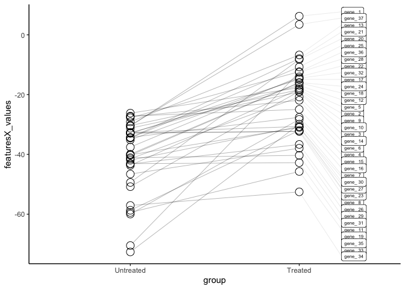
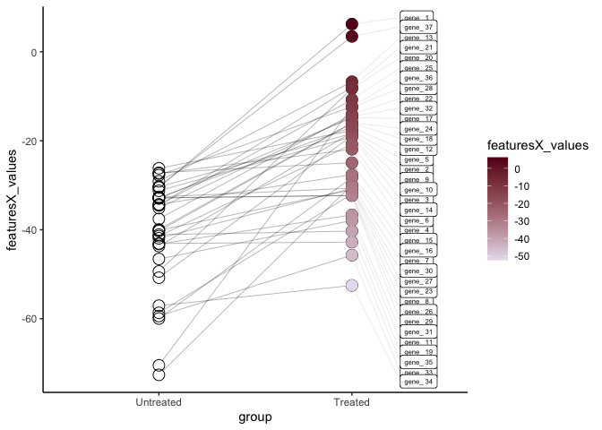
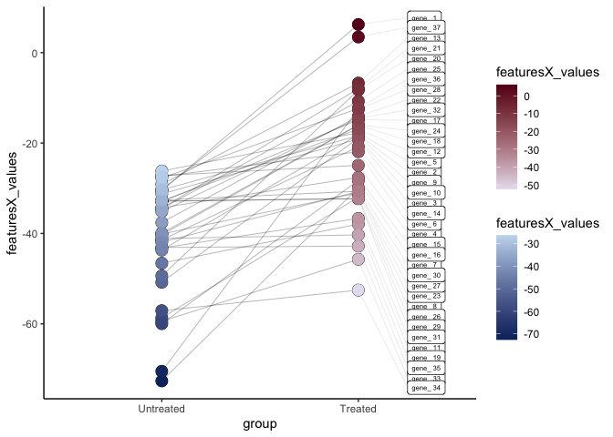

# Data_viz: paring over conditions

Wael Kamel

28/09/2021

## Visualize the feature-distribution of different genes/proteins (intestity, reads, arbitrary units, etc) over different conditions with different color scales

``` r
library(tidyverse)
```

    ## ── Attaching packages ─────────────────────────────────────── tidyverse 1.3.1 ──

    ## ✓ ggplot2 3.3.3     ✓ purrr   0.3.4
    ## ✓ tibble  3.1.4     ✓ dplyr   1.0.7
    ## ✓ tidyr   1.1.3     ✓ stringr 1.4.0
    ## ✓ readr   2.0.1     ✓ forcats 0.5.1

    ## Warning: package 'stringr' was built under R version 3.5.2

    ## ── Conflicts ────────────────────────────────────────── tidyverse_conflicts() ──
    ## x dplyr::filter() masks stats::filter()
    ## x dplyr::lag()    masks stats::lag()

``` r
library(ggrepel)
```

    ## Warning: package 'ggrepel' was built under R version 3.5.2

``` r
library(ggnewscale)

# loading your data for example


paired_data = as.data.frame(read.table("paired_data.txt", sep="\t",header=TRUE))

# data consists mersurment of certain feature (X) over two conditions Untreated and Treated for a number of 

head(paired_data, 10)
```

    ##    gene_no     group featuresX_values
    ## 1  gene_ 1   Treated         6.227199
    ## 2  gene_ 1 Untreated       -30.525532
    ## 3  gene_ 2   Treated       -18.163463
    ## 4  gene_ 2 Untreated       -43.673183
    ## 5  gene_ 3   Treated       -19.118394
    ## 6  gene_ 3 Untreated       -31.247054
    ## 7  gene_ 4 Untreated       -27.194422
    ## 8  gene_ 4   Treated       -24.940443
    ## 9  gene_ 5   Treated       -17.701091
    ## 10 gene_ 5 Untreated       -26.190224

``` r
paired_data$group<- factor(paired_data$group ,levels=c("Untreated","Treated"))


# ploting the outline of the plot

paired_data.svg=ggplot(paired_data , aes(x= group, y= featuresX_values)) +
  geom_line(aes(group = gene_no), size=0.2, alpha= 0.5)+
  geom_point(size= 4, color="white" )+
  geom_point(shape = 1,size = 4.2,colour = "black")+
  theme_classic()
paired_data.svg= paired_data.svg+ 
  geom_label_repel( force = 0.5,nudge_x  = 0.25,direction = "y",hjust  = 0,segment.size= 0.1,segment.alpha = 0.3,
                    size= 2,aes(label=ifelse(group=="Treated", as.character(gene_no), "")))

paired_data.svg
```



``` r
#we want to have two different color scales, one for each conditions. first we will add one, using geom_point as a filler and standard scale_color_gradientn

paired_data.svg= paired_data.svg+
  geom_point(data = subset(paired_data, group =="Treated"), aes(color = featuresX_values), size=4)+
  scale_color_gradientn(colors = c("#e7e1ef","#67001f"))


paired_data.svg
```



``` r
# to add the second color scale, this is the tricky part and we use  new_scale_color() from (ggnewscale),  which made it very easy
paired_data.svg= paired_data.svg+
  new_scale_color() +
  geom_point(data = subset(paired_data, group =="Untreated"), aes(color = featuresX_values), size=4)+
  scale_color_gradientn(colors = c("#08306b","#c6dbef"))

# here is how it looks
paired_data.svg
```


